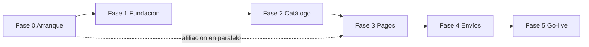

# INEEDYOUGT — Plan por fases

**Proyecto:** Tienda online de ropa (niños, adolescentes, adultos)  
**Marca:** I NEED YOU — *Crea tu estilo*  
**Referencia de estilo/flujo:** https://aybstore.gt/  
**Mercado:** Guatemala (GTQ)  
**Plataforma base:** Next.js (App Router) — elegida porque el entorno local no tenía PHP/Docker; misma lógica de negocio que el plan WooCommerce.  
**Pasarela de tarjeta:** QPayPro (Visa/Mastercard) — alternativa directa: VisaNet / CyberSource  

### Estado actual (desarrollo)
- **Fases 1–5 listas:** tienda + admin (`/admin`) para productos/pedidos, checklist QA, manual cliente y go-live.
- **Pendiente cliente / producción:** dominio HTTPS, QPayPro prod, SMTP/Resend, WhatsApp real (`NEXT_PUBLIC_WHATSAPP`), fotos y catálogo real vía admin.

---

## Resumen de fases

| Fase | Nombre | Duración orientativa | Depende de |
|------|--------|----------------------|------------|
| 0 | Arranque legal y técnico | 1–2 días + espera afiliación (~10 días hábiles) | Cliente |
| 1 | Fundación de la tienda | 1–2 semanas | Fase 0 (hosting/dominio) |
| 2 | Catálogo inteligente y UX | ~1 semana | Fase 1 |
| 3 | Pagos y checkout | 3–7 días | Afiliación QPayPro/VisaNet |
| 4 | Envíos, notificaciones y pulido | 3–5 días | Fase 3 |
| 5 | Contenido real, QA y entrega | 3–7 días | Fases 1–4 + fotos/productos del cliente |

**Tiempo total estimado de desarrollo:** 4–6 semanas (la afiliación de pagos corre en paralelo y puede alargar el go-live).

---

## Fase 0 — Arranque legal y técnico

**Objetivo:** Tener dominio, hosting y proceso de pagos en marcha antes o mientras se construye.

### Tareas del desarrollador
- [ ] Recomendar y configurar hosting (WordPress managed o VPS)
- [ ] Registrar / apuntar dominio (ej. ineedyougt.com o .gt)
- [ ] Instalar WordPress, SSL (HTTPS)
- [ ] Crear cuentas: hosting, dominio, correo de tienda, QPayPro
- [ ] Checklist de papelería para afiliación (enviar a Shannon)

### Tareas de la cliente (Shannon)
- [ ] Confirmar nombre de dominio
- [ ] Reunir papelería: patente de comercio, RTU, DPI, recibo de servicios, cheque anulado
- [ ] Iniciar afiliación **QPayPro** (recomendado para arrancar) o VisaNet/CyberSource
- [ ] Definir cuenta bancaria para liquidaciones
- [ ] Enviar logo en alta resolución (PNG/SVG) y guía de marca si existe

### Entregables
- Sitio WordPress en blanco con HTTPS
- Accesos entregados al cliente (o guardados documentados)
- Solicitud de pasarela en proceso

### Criterio de done
Hosting + dominio + SSL listos; afiliación de pagos iniciada.

---

## Fase 1 — Fundación de la tienda

**Objetivo:** Tienda usable con look de marca, carrito y estructura base (sin pagos con tarjeta aún).

### Tareas
- [ ] Instalar WooCommerce (moneda GTQ, país GT, impuestos según acuerdo)
- [ ] Tema base + personalización de marca (logo, tipografías, colores I NEED YOU)
- [ ] Home tipo referencia AYB:
  - Hero full-bleed con marca + 1 headline + 1 CTA
  - Bloque de beneficios (envíos, pago seguro, 24/7, etc.)
  - Secciones: categorías, nuevo ingreso, destacados
- [ ] Páginas: Inicio, Tienda, Carrito, Mi cuenta, Contacto, Envíos, Políticas
- [ ] WhatsApp flotante / CTA de asesoría
- [ ] Productos de demostración (placeholders) con variaciones de talla/color
- [ ] Carrito funcional (añadir / editar / vaciar)
- [ ] Responsive mobile

### Entregables
- Home + tienda + ficha de producto + carrito en staging
- Identidad visual aplicada (B&W + acento definido con cliente)

### Criterio de done
Un visitante puede navegar, ver productos demo, elegir talla/color y llenar el carrito en móvil y desktop.

---

## Fase 2 — Catálogo inteligente y UX

**Objetivo:** Filtrar por edad, género, categoría, talla; experiencia de compra clara.

### Estructura de catálogo
```
Categorías (prenda): Blusas, Jeans, Sets, Vestidos, Accesorios, …
Segmento / edad:    Niños | Adolescentes | Adultos
Género:             Mujer | Hombre | Unisex | Niña | Niño
Atributos:          Talla, Color (+ stock por variación)
```

### Tareas
- [ ] Taxonomías / atributos WooCommerce según estructura
- [ ] Filtros en tienda (edad, género, categoría, talla, precio)
- [ ] Ficha de producto: galería, selector talla/color, stock, precio Q
- [ ] Badge “Nuevo” / destacados
- [ ] Lista de deseos (wishlist)
- [ ] Búsqueda de productos
- [ ] Menú por segmento (ej. Niños / Adolescentes / Mujer / Hombre)
- [ ] Estados vacíos claros (“Sin stock en esta talla”)

### Entregables
- Catálogo filtrable completo
- Wishlist operativa
- Navegación por género/edad

### Criterio de done
Se puede encontrar un producto por segmento + género + talla en menos de 3 clics.

---

## Fase 3 — Pagos y checkout

**Objetivo:** El cliente elige método de pago y completa el pedido.

### Métodos de pago (checkout)
1. **Tarjeta Visa / Mastercard** → QPayPro (hosted checkout)
2. **Pago contra entrega** (efectivo al recibir)
3. **Transferencia / depósito bancario** (instrucciones + pedido en espera)
4. *(Opcional)* Visa Cuotas / Master Cuotas si el plan de QPayPro lo incluye

### Tareas
- [ ] Plugin / integración QPayPro en WooCommerce
- [ ] Credenciales sandbox → pruebas → producción
- [ ] Activar contra entrega y transferencia con textos claros
- [ ] Campos de checkout: nombre, teléfono, dirección GT, departamento/municipio, notas
- [ ] Página de gracias / fallo de pago
- [ ] Estados de pedido: pendiente pago | procesando | contra entrega | cancelado
- [ ] Pruebas con tarjetas de prueba y flujo real controlado

### Entregables
- Checkout con selector de método de pago
- Cobros con tarjeta en ambiente de prueba (luego producción)
- Documentación corta: “cómo se ve un pedido pagado vs contra entrega”

### Criterio de done
Pedido de prueba con tarjeta aprobado; pedido COD y transferencia creados correctamente.

### Bloqueo
Sin afiliación aprobada no hay go-live de tarjeta (sí se puede lanzar antes solo con COD + transferencia).

---

## Fase 4 — Envíos, notificaciones y pulido

**Objetivo:** Operación diaria lista: envíos, correos y confianza del comprador.

### Tareas
- [ ] Zonas de envío Guatemala (departamentos / tarifas fijas o por rango)
- [ ] Opción “retiro en tienda” si aplica
- [ ] Emails: pedido recibido, pago confirmado, enviado
- [ ] SMS/WhatsApp manual o automatizado (opcional)
- [ ] Política de cambios/devoluciones publicada
- [ ] SEO básico (títulos, OG image, favicon)
- [ ] Velocidad: caché, imágenes optimizadas
- [ ] Backup automático

### Entregables
- Envíos configurados
- Correos de pedido funcionando
- Políticas visibles en el sitio

### Criterio de done
Un pedido completo genera email y calcula envío según zona.

---

## Fase 5 — Contenido real, QA y entrega

**Objetivo:** Tienda con productos reales, capacitada y lista para vender.

### Tareas
- [ ] Cargar productos reales (o capacitar a Shannon para cargarlos)
- [ ] Revisar fotos, tallas, precios, stock
- [ ] QA checklist (ver abajo)
- [ ] Capacitación: crear producto, gestionar pedido, marcar enviado
- [ ] Pasar a producción (DNS, SSL, QPayPro live)
- [ ] Monitoreo primera semana de ventas

### Checklist QA
- [ ] Home, tienda, filtros, ficha, carrito, checkout
- [ ] Pago tarjeta (sandbox + 1 real de bajo monto)
- [ ] COD y transferencia
- [ ] Mobile (iOS/Android) y Chrome/Safari
- [ ] Stock por talla se descuenta
- [ ] WhatsApp y contacto
- [ ] Textos legales y envíos

### Entregables
- Sitio en producción
- Manual corto (PDF o Notion) para la cliente
- Accesos y handoff

### Criterio de done
Shannon puede publicar un producto y completar un pedido de punta a punta sin ayuda.

---

## Cotización por fases (plantilla)

Completar montos al hablar con Shannon. Los rangos son solo guía de esfuerzo.

| Fase | Esfuerzo | Monto sugerido (completar) | Notas |
|------|----------|----------------------------|--------|
| 0 Arranque | Bajo / setup | Q ___ | Dominio/hosting aparte (cliente o incluido) |
| 1 Fundación | Alto | Q ___ | Diseño + Woo base |
| 2 Catálogo UX | Medio-alto | Q ___ | Filtros y wishlist |
| 3 Pagos | Medio | Q ___ | Depende de QPayPro listo |
| 4 Envíos y pulido | Medio | Q ___ | |
| 5 QA y entrega | Medio | Q ___ | Carga masiva de productos = extra si son muchos |
| **Total desarrollo** | | **Q ___** | |
| Afiliación QPayPro | Cliente | ~USD $149 + comisión/txn | Verificar tarifa vigente |
| Hosting + dominio (anual) | Cliente u opcional | Q ___ | |

**Forma de pago sugerida al cliente**
- 40% al iniciar (Fase 0–1)
- 40% al terminar Fase 3 (pagos en staging)
- 20% al go-live (Fase 5)

---

## Fuera de alcance (cotizar aparte)

- App móvil nativa
- Facturación FEL / satélite contable
- Fotografía profesional de producto
- Campañas Ads / community management
- Integración con inventario físico / POS
- Multi-idioma
- Programa de puntos / afiliados

---

## Orden de trabajo recomendado



---

## Preguntas abiertas (bloquear cotización final)

1. ¿Dominio preferido?
2. ¿Patente/RTU listos para QPayPro?
3. ¿Catálogo día 1: solo mujer o también niños/hombres?
4. ¿Cuántos productos al lanzar?
5. ¿Envío tarifa fija o por departamento?
6. ¿Fecha deseada de lanzamiento?
7. ¿Presupuesto máximo?

---

*Documento para propuesta comercial — INEEDYOUGT — actualizable por fase.*
